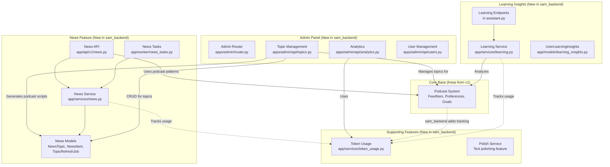
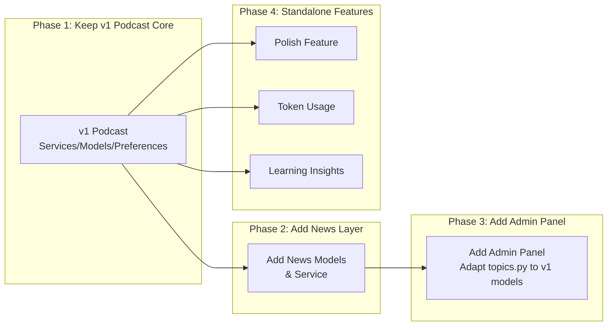

# Repository Analysis: v1 vs sam_backend Branches

## Executive Summary

This document analyzes Hossein Asgari's commits and compares the podcast implementations between **v1 (prod)** and **sam_backend** branches to help you decide how to merge features while preserving v1's superior podcast implementation.

---

## 1. Commit Verification ✅

**Confirmed: Hossein made exactly 2 commits** on sam_backend:
- `cab2c4e` - "feat(assistant): implement intelligent text polishing service"
- `f2562bf` - "Admin Panel" (the massive 32k+ lines commit)

No additional commits were found beyond what you documented.

---

## 2. Podcast Implementation Comparison

### v1 (Production) Podcast Architecture

| Component | Files | Description |
|-----------|-------|-------------|
| **API Router** | `app/api/v1/podcast.py` | Endpoints for preferences, categories, goals, feed |
| **Service Layer** | `app/services/podcast.py` | Full business logic, topic generation, feed management |
| **Models** | `podcast_preferences.py`, `feed_item.py` | Structured data models |

#### v1 Models (from `models/__init__.py`):
- `PodcastTopicCategory` - Categories for podcast topics
- `LearningGoal` - User learning goals
- `UserPodcastPreference` - User preference storage
- `UserPodcastTopicCategory` - Many-to-many relationship
- `UserPodcastGoal` - User goal tracking
- `FeedItem` - Feed content items

#### v1 Key Features:
✅ Structured preference system with category/goal validation  
✅ Dedicated feed management with `FeedItem` status tracking  
✅ Clean service layer separation  
✅ Support for resuming podcasts (last_segment_index tracking)  
✅ Proper many-to-many relationships for user preferences  

---

### sam_backend Podcast Architecture

| Component | Files | Description |
|-----------|-------|-------------|
| **API Router** | `app/api/v1/podcast.py` | 727 lines, endpoints inline with Gemini calls |
| **Service Layer** | ❌ **DELETED** | `app/services/podcast.py` removed |
| **Models** | ❌ `feed_item.py` deleted, ❌ `podcast_preferences.py` deleted | Replaced with news models |

#### sam_backend Models (from `models/__init__.py`):
- ❌ No `FeedItem`
- ❌ No `PodcastTopicCategory`, `LearningGoal`, `UserPodcastPreference`, etc.
- ✅ `PolishSuggestions` (new)
- ✅ `UserLearningInsights` (new)
- ✅ `NewsTopic`, `UserTopicPreference`, `NewsItem`, `TopicRefreshJob` (new)
- ✅ `TopicPodcastScript`, `TopicArticle`, `UserTopicFeedback` (new)
- ✅ `TokenUsageDaily` (new)

#### sam_backend Key Features (podcast):
- Inline implementation without service layer
- Uses `TokenUsageService` for tracking
- Added `/news/podcast` endpoint that generates podcasts from grounded news search
- Static `IMAGE_GALLERY` for image selection
- **Lacks: FeedItem system, preference structure, learning goals, resume capabilities**

---

## 3. Verdict: v1 Podcast is Superior ✅

> [!IMPORTANT]
> **v1's podcast implementation is architecturally better because:**
> 1. Proper service layer separation (maintainable, testable)
> 2. Structured preference system with validation
> 3. FeedItem model for tracking play state/resume
> 4. Category/Goal models for personalization
> 5. Clean many-to-many relationships

---

## 4. Feature Dependency Chains

The following diagram shows which sam_backend features depend on the podcast concept as a base:

---

## 5. Feature Groups for Migration

Based on the dependency analysis, here are the feature chains you need to consider:

### Chain 1: News System → Podcast
| Component | Path | Dependencies |
|-----------|------|--------------|
| News API | `app/api/v1/news.py` | News models, news service |
| News Service | `app/services/news.py` | NewsTopic, NewsItem models, Gemini client |
| News Models | `app/models/news.py` | Base SQLAlchemy models |
| News Tasks | `app/worker/news_tasks.py` | Celery, news service |
| Schemas | `app/schemas/news.py` | Pydantic schemas |

> [!NOTE]
> The `/news/podcast` endpoint in sam_backend's podcast.py (lines 272-397) generates podcasts from live news using Google Search grounding. This could be **added to v1's podcast.py** as an additional feature.

---

### Chain 2: Admin Panel → News → Podcast
| Component | Path | Dependencies |
|-----------|------|--------------|
| Admin Router | `apps/admin/router.py` | All admin sub-routers |
| Topics API | `apps/admin/api/topics.py` | NewsTopic model, generates podcasts |
| Analytics | `apps/admin/api/analytics.py` | TokenUsageDaily |
| User Mgmt | `apps/admin/api/users.py` | User model |
| Static Frontend | `apps/admin/static/*` | HTML/CSS/JS |

**Key insight:** Admin panel's topics.py has `generate_topic_podcast()` and `generate_topic_article()` that directly use the **News models**, not the original podcast preference models.

---

### Chain 3: Learning Insights → Grammar Corrections
| Component | Path | Dependencies |
|-----------|------|--------------|
| Learning Service | `app/services/learning.py` | GrammarCorrection, GeminiAgent |
| Learning Model | `app/models/learning_insights.py` | User model |
| Learning API | `app/api/v1/assistant.py` (additions) | Learning service |

**Independent from podcast core**, but added endpoints to assistant.py.

---

### Chain 4: Token Usage Tracking
| Component | Path | Used By |
|-----------|------|---------|
| Token Service | `app/services/token_usage.py` | Podcast, News, Learning |
| Token Model | `app/models/token_usage_daily.py` | Token service |

**Cross-cutting concern** - added to many features for cost tracking.

---

### Chain 5: Polish Feature (Standalone)
| Component | Path | Dependencies |
|-----------|------|--------------|
| Polish Model | `app/models/polish_suggestions.py` | Base |
| Polish Endpoint | `app/api/v1/assistant.py` | GeminiAgent, polish model |
| Polish Prompt | `app/files/prompt/polish_system_prompt.txt` | None |

**Fully standalone**, can be migrated independently.

---

## 6. Recommended Migration Strategy

### Specific Actions:

1. **Keep from v1:**
   - `app/services/podcast.py` (don't delete!)
   - `app/models/feed_item.py`
   - `app/models/podcast_preferences.py`
   - All FeedItem/preference-related endpoints

2. **Cherry-pick from sam_backend:**
   - `/news/podcast` endpoint (add to v1's podcast.py, lines 272-397)
   - Token usage tracking (add to existing endpoints)
   - Polish feature (standalone)
   - Learning insights (standalone)

3. **Adapt Admin Panel:**
   - The topics.py in admin uses `NewsTopic` model
   - Needs adaptation to work with v1's `PodcastTopicCategory` or keep as parallel system

---

## 7. Files Changed Summary

### Deleted from v1 (need to preserve):
| File | Lines | Purpose |
|------|-------|---------|
| `app/services/podcast.py` | 534 | **Critical - preserve this!** |
| `app/models/feed_item.py` | 65 | FeedItem model |
| `app/models/podcast_preferences.py` | 105 | All preference models |

### New in sam_backend (candidate for migration):
| File | Lines | Feature Chain |
|------|-------|---------------|
| `app/api/v1/news.py` | 201 | News |
| `app/services/news.py` | 312 | News |
| `app/models/news.py` | 97 | News |
| `app/services/learning.py` | 250 | Learning |
| `app/services/token_usage.py` | 102 | Token tracking |
| `apps/admin/*` | ~2000+ | Admin panel |
| `app/models/polish_suggestions.py` | 25 | Polish (standalone) |

---

## Questions for You

1. Do you want to keep the **News feature** separate from the podcast preferences system, or merge them?
2. Should the admin panel manage **both** v1's podcast categories AND the new news topics?
3. Is the `/news/podcast` grounded search feature something you want in v1?
